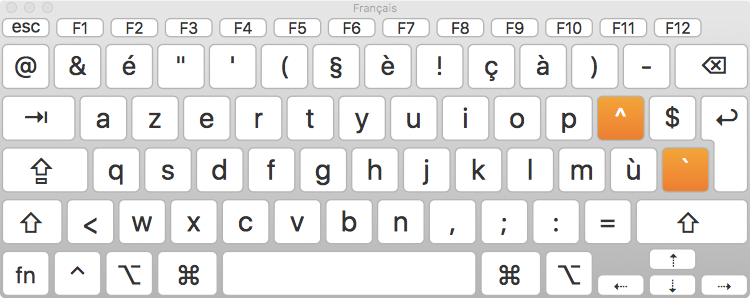
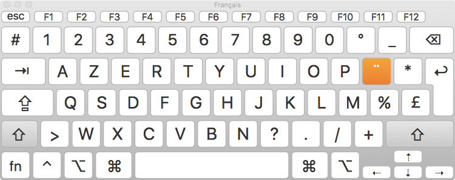
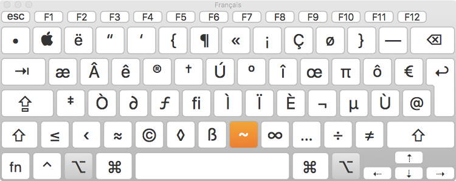
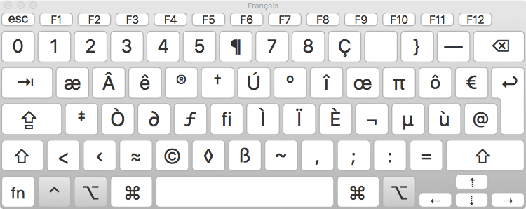
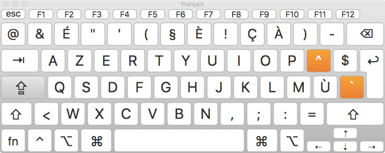
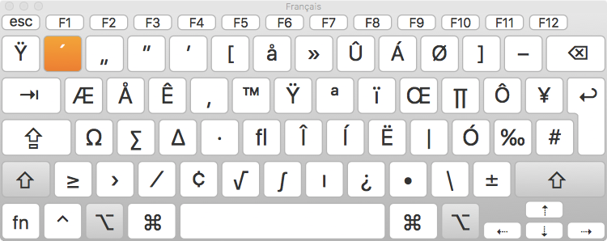
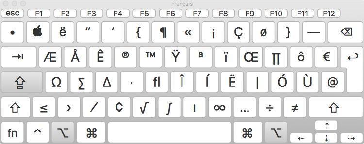
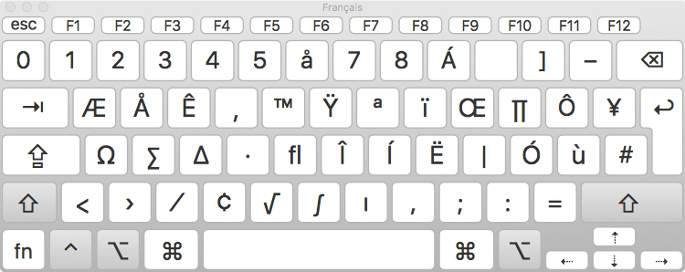
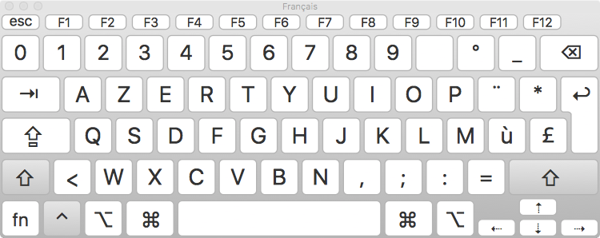

=============================================================

  French Macbook Keyboard Layout For Windows (fmbkl4w) 1.0
          par Nicolas Leclerc <nl@spirotron.fr>
  
=============================================================

I. Objectif
-------------------

Ce projet vise à remédier à l’absence de fichier de définition windows pour les claviers
de Macbook français et par extension les petits clavier alu d'Apple (avec ou sans fil).
Il est important de noter que le grand clavier alu (avec pavé numérique) n’est pas supporté.

II. License
-------------------

Le fmbkl4w est sous license GPL v3.0.
Vous trouverez sa description complète dans le fichier gpl-3.0.txt ou bien à l'adresse :
http://www.gnu.org/licenses/gpl.html

III. Installation
-------------------

Pour commencer vous devez vous procurer le package d’installation
  * soit en le téléchargeant à l’adresse : http://github.com/nleclerc/fmbkl4w/downloads
  * soit en le compilant à partir des sources (voir plus bas).

Une fois ce package décompressé ou compilé, il vous suffit d’exécuter le fichier setup.exe
et de suivre les instructions.

IV. Compilation
-------------------

Pour compiler le fichier klc vous aurez besoin du Microsoft Keyboard Layout Creator (mklc).
Celui-ci est disponible à l'adresse:
http://www.microsoft.com/downloads/en/details.aspx?FamilyId=8BE579AA-780D-4253-9E0A-E17E51DB2223

Une fois installé, vous n’aurez qu’à l’exécuter et ouvrir le fichier fmbkl4w.klc.
Une fois chargé il vous suffit d’aller de faire project/Build DLL and Setup Package
pour que l’installeur soit généré dans votre dossier Mes Documents.

V. Problèmes Connus
-------------------

* Certaines combinaisons de touches spéciales ne sont pas supportées mais l’essentiel
  devrait y être. En tout cas il est tout à fait possible de programmer avec :)

* A noter que si vous utilisez un PC lambda (et non un mac sous bootcamp), il est quasi indispensable
  d’installer malgré tout les drivers de clavier bootcamp afin que certaines combinaisons fonctionnent
  (comme fct+backspace). Vous devrez extraire le driver seul du package bootcamp général en décompressant
  l’ensemble avec par exemple 7-zip.
  
  Les drivers bootcamp sont disponibles à l’adresse : http://support.apple.com/fr_FR/downloads/#macoscomponents

Screenshots des claviers :

